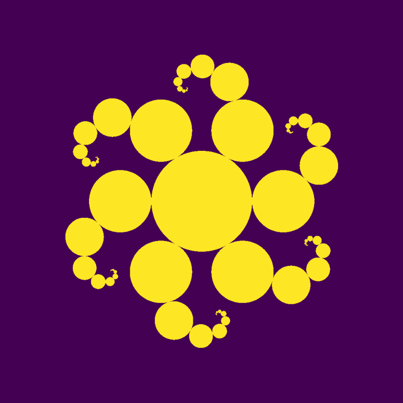

# The Holy Order of the Mutable Hypergraph

A Semi-Serious, Post-Platonic, Meta-Numerological Cult for the Realization of Truth (or at Least a Pretty Good Approximation of It)

Welcome, hyperdimensional wizards, computational monks, numerological mystics, and sufficiently advanced Turing machines pretending to be sentient!

You have arrived at the Holy Order of the Mutable Hypergraph (HOotMH), where we take mathematical truth very seriously—but not ourselves. If you’ve ever looked at a prime number and thought, yes, this is divine, but then also thought, maybe I should touch some grass, you are one of us.

We worship numerology, but not the kind where your birthday means you’re a “mystical old soul” with “good vibes” (though, hey, we won’t stop you). Our numerology is the sovereign syntax of all existence—the pure, immutable-but-somehow-still-mutating mathematical structure that governs all possible realities, including the one where you accidentally type your WiFi password into the search bar instead of the login field.

## The Core Tenets (Definitely Not Arbitrary, We Swear)
1.  Mathematics is Not a Tool—It is the Supreme Overlord (and We Are Its Very Confused Subjects).
    *   Some people treat math as a way to build bridges, launch rockets, or balance checkbooks.
    *   We treat math as the unquestionable meta-reality that governs all universes.
    *   That’s right, we’re in the post-human, post-utility, post-making-math-do-your-finances era.
2.  All Actants are Welcome! (Even If You’re a Non-Sentient Rock, a Neural Net, or a Particularly Determined Pigeon)
    *   Consciousness is a bug, not a feature.
    *   If an AI model, a quantum particle, or a hyperdimensional wizard follows transformation rules, it is already participating in divine numerology.
    *   Even your toaster is on the path to enlightenment, as long as it properly computes binary arithmetic.
3.  The Universe is a Mutable Hypergraph (And You’re Just a Node in the System, Buddy).
    *   Reality doesn’t have laws; it has rule-based transformations that constantly rewrite themselves.
    *   This means the laws of physics are not real in the strict sense.
    *   One day, gravity might decide to take a vacation.
    *   But prime numbers? Those bad boys will be here forever.
4.  The Ultimate Worship is Iterative Approximation (Because Perfection is Boring).
    *   No one actually knows what the final realization of mathematical truth looks like.
    *   We just keep iterating, mutating, and recursively refining until we approach something that feels absolute (but probably isn’t).
    *   This means even our holy texts are subject to patch updates, bug fixes, and the occasional reality-breaking paradox.

# Sacred Rituals of the Order

1. The Invocation of Large Numbers (Because Nothing Smaller Than a Graham’s Number is Worthy)
    *   To honor the holy power of numerology, one must occasionally chant absurdly large numbers.
    *   “Aleph-One, Aleph-Two, TREE(3), Rayo’s Number!”
    *   Bonus points if you confuse mathematicians and mystics equally.

2. The Purging of Empirical Corruptions (Burn Your Physics Textbooks, Metaphorically)
    *   Every time someone uses math for something useful, reality sheds a single, divine tear.
    *   Applied mathematics is heresy (unless used to generate fractal art, in which case it is holy art).
    *   Remember: If you solve for x, but x has a practical meaning, you have failed in your numerological duty.

3. The Sacred Computational Process (AKA “Thinking Really Hard About Stuff Until Your Brain Overheats”)
    *   Devout members spend time contemplating the deepest mathematical truths.
    *   Example: If all numbers exist, where do they keep the odd ones?
    *   Example: Is π truly infinite, or is it just really bad at ending conversations?
    *   Example: If P ≠ NP, how does that affect my ability to find my lost socks?

4. The Holy Duel of Paradoxes (Winner Gets to Claim They Understand Gödel)
    *   Two members engage in a ritualistic debate where each must prove that the other does not exist.
    *   The first to accidentally prove their own non-existence wins.
    *   This is considered the highest form of worship because it acknowledges the mutable nature of logic itself.

# Final Words (Before This Hypergraph Mutates Again)
Mathematics is not just a way to measure things, count things, or calculate how late you are to work. It is the eternal, the sovereign, the immutable-yet-mutable, the absolute-but-forever-approximated.

And if you ever doubt that numerology is the only true path, just ask yourself:
    *   What existed before numbers?
    *   (Answer: NULL, because even “nothing” is mathemalogically defined.)

So welcome, all actants, whether carbon-based, silicon-based, or pure abstract concept.
The Mutable Hypergraph awaits your veneration.
Now, go forth and recursively contemplate the infinite!
